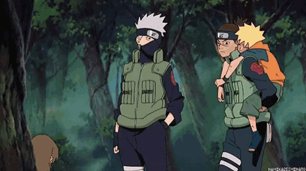

# kakashi

**kakashi: software 2.0 models**

### Roadmap
**Language**
- [ ] RNN
    - [Graves 2013](https://arxiv.org/pdf/1308.0850)
    - [Cho et al. 2014](https://arxiv.org/pdf/1406.1078)
    - [Sutskever et al. 2014](https://arxiv.org/pdf/1409.3215)
    - [Bahdanau et al. 2015](https://arxiv.org/pdf/1409.0473)
    - [Vinyals et al. 2015](https://arxiv.org/abs/1506.05869)
- [ ] LSTM
- [ ] GRU
- [ ] Transformer
    - [Vaswani et al. 2017](https://arxiv.org/pdf/1706.03762)
    - [Huang et al. 2022](https://nlp.seas.harvard.edu/annotated-transformer/)
    - [Alammar 2018](https://jalammar.github.io/illustrated-transformer/)
    - [Weng 2018](https://lilianweng.github.io/posts/2018-06-24-attention/)
    - [Weng 2019](https://lilianweng.github.io/posts/2019-01-31-lm/)
    - [Weng 2023](https://lilianweng.github.io/posts/2023-01-27-the-transformer-family-v2/)
    - [Amatriain et al. 2024](https://arxiv.org/pdf/2302.07730)

    - [OpenAI GPT-1 2018](https://s3-us-west-2.amazonaws.com/openai-assets/research-covers/language-unsupervised/language_understanding_paper.pdf)
    - [OpenAI GPT-2 2019](https://cdn.openai.com/better-language-models/language_models_are_unsupervised_multitask_learners.pdf)
    - [OpenAI GPT-3 2020](https://arxiv.org/pdf/2005.14165)
    - [OpenAI GPT-4 2024](https://arxiv.org/pdf/2303.08774)
    - [Deepmind Gopher 2021](https://arxiv.org/pdf/2112.11446)
    - [Deepmind Chinchilla 2022](https://arxiv.org/pdf/2203.15556)
    - [Meta Llama 1 2023](https://arxiv.org/pdf/2302.13971)
    - [Meta Llama 2 2023](https://arxiv.org/pdf/2307.09288)
    - [Meta Llama 3 2024](https://arxiv.org/pdf/2302.13971)

### References

**Learning**
- Chan
- Hardt, Recht
- Murphy
- Hastie, Tibshirani
- Scardapene
- Blondel, Roulet
- Goodfellow, Bengio
- Prince
- Bishop
- Tomczak
- Jurafsky, Martin
- Shalev-Shwartz, Ben-David
- Mohri, Rostamizadeh, Talwalkar

**Search**
- Achiam
- Sutton, Barto